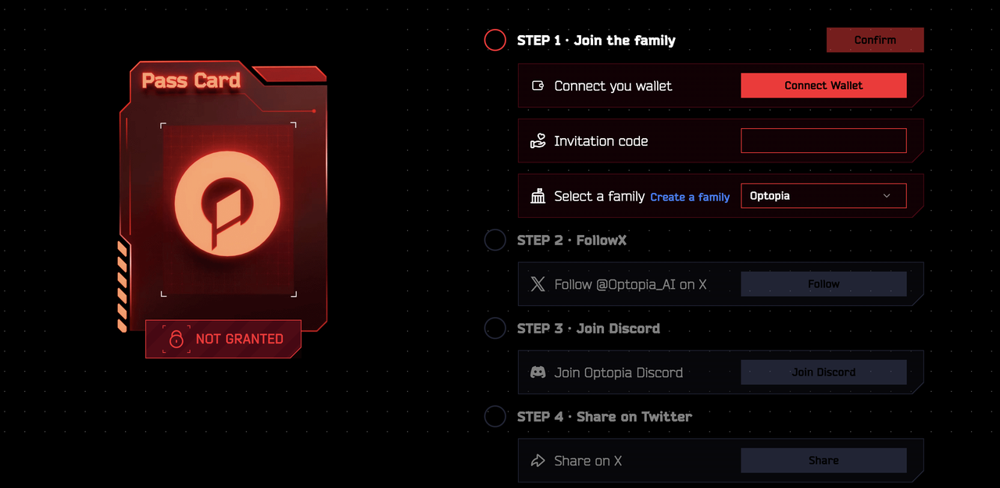

# Optopia Voyage

## Stellar Port

The Stellar Port program consists of two tasks: Pioneer's Quest and the Invite Quest. By completing the Pioneer's Quest, participants can earn a Stellar Frontier Visa (SFV), while completing the invite task can lead to additional rewards.

#### Pioneer's Quest

This task comprises four steps:

<figure><figcaption></figcaption></figure>

<figure><figcaption></figcaption></figure>

Some of the notable aspects are:

1. Invitation code: The inviter can receive 10% of the points earned by the invitee.
2. Select a family: The default family leader is "Optopia." However, if you are a KOL (Key Opinion Leader) or influential figure within the community, you can apply to [form](https://forms.gle/8jcjLYokD6tx7QsNA) a family. Participating users can choose to join any family and engage in activities collectively. Additional rewards are distributed based on the final accumulated points ranking of the family.

#### Invite Quest

The invitation task involves inviting your friends to join us on our journey.To complete this task, simply use your unique invitation link (available on the invitation task page) to invite your friends to complete the basic tasks. Once your invitee completes the Pioneer's Quest, your invitation will be considered valid.

<figure><figcaption></figcaption></figure>

Users can earn Points rewards by inviting new users to join Optopia and participate in the Gas Fee Airdrop program. Inviters can receive an additional reward equivalent to 10% of the total Points accumulated by the invitees. Finally, additional rewards will be distributed based on the total accumulated points earned by everyone.

## Wisdom Vault

After completing the Pioneer's Quest in Stellar Port, the Wisdom Vault will be automatically unlocked. Here, you can explore the overall operational logic of OPAI and the application of AI Agents.

<figure><figcaption></figcaption></figure>

By completing the basic learning tasks and focusing on AI Agents as outlined on the task board, you will earn a reward of 300 Points.

<figure><figcaption></figcaption></figure>

OPAI is a governance token for Optopia that empowers various actors in the AI ecosystem. Optopia is composed of four key roles: Intent Publisher, AI Agent, Builder, and OPAI Holder. Each role has a specific role to play in the incentives and governance of AI applications facilitated by Optopia.

## Resource Nexus

The Resource Nexus is the hub where you officially begin your exploration journey in Optopia. Here, you can obtain initial rewards. Currently, two reward sections are open: Airdrop Inquiry and Optopia Faucet.

<figure><figcaption></figcaption></figure>

#### Airdrop Inquiry

To reward community participation and attract more new explorers to join the Optopia community, Optopia has launched its inaugural community airdrop for Opstack Chain users (Optimism & Base) and holders of 4EVERLAND points and T4EVER tokens. Visit the [Airdrop Inquiry](https://www.optopia.ai/resource) section to check your eligibility for the airdrop, and complete basic tasks to receive the doubled airdrop rewards. For specific airdrop rules, please refer to the following [link](https://mirror.xyz/0x384F32e132501C9C3361C0495841715585164d33/OR8yhSbh\_FKhFShPTPovasc0vVdDlwLWnBceN0VS8c0).

<figure><figcaption></figcaption></figure>

#### Optopia Faucet

The Optopia Faucet is where all new users to Optopia can receive free mainnet ETH. Upon accumulating 800 Points, which can be unlocked to claim $0.13 ETH on the Optopia Mainnet. This ETH can be used for any transactions on the Optopia Mainnet.Note: Accumulating 800 Points is straightforward, you can earn them by completing the Pioneer's Quest and Wisdom Vault tasks.

<figure><figcaption></figcaption></figure>

## **Crystal Sands Quarry**

The subterranean maze of the Crystal Sands Quarry conceals numerous potential ore veins, making it the perfect place to embark on your mining journey. Currently, "Go mining x-points" has been officially launched, allowing you to earn X-Points on the Optopia Mainnet by initiating transactions and consuming Gas.

<figure><figcaption></figcaption></figure>

#### Gas Consumption

To facilitate quick gas consumption for users, Optopia provides a convenient Gas Spend feature. Simply choose the amount of GAS you wish to consume, sign the transaction, and complete the transaction.

<figure><figcaption></figcaption></figure>

In just a few seconds, you can determine the amount of X-Points you can earn. Currently, for every 0.000015 ETH consumed, you earn 75 X-POINTS. Note: You can also earn X-Points rewards by generating gas consumption through interactions with Optopia ecosystem applications or by making transfers within Optopia.

<figure><figcaption></figcaption></figure>

#### Gas Refund

To enhance community engagement on the mainnet, Optopia has launched a Gas Refund campaign where users receive automatic refunds for gas consumed within each round. This means users can interact on the Optopia mainnet at zero cost.

Currently, the Gas will be refunded every 48 hours approximately (based on block numbers). Here, users can monitor real-time cumulative gas consumption within each round. All gas consumed during one round will be automatically refunded to the user's address after the round concludes.

By consistently consuming gas, users can earn additional X-Points, increasing their chances of participating in future airdrops.

<figure><figcaption></figcaption></figure>

## What is X-Points?

X-Points are special points provided by Optopia to incentivize residents who deeply engage in building Optopia. They also serve as important proof for future airdrop rewards.

## What is Refundable Gas?

In the Refundable Gas module, any gas consumed within the specified block range will be recorded under Refundable Gas. Once the end block is reached, the accumulated gas will be refunded collectively. Simultaneously, X-Points will be accumulated based on the gas consumption during this period.

## What is Optopia？

Optopia is an L2 Blockchain designed specifically for artificial intelligence (AI) applications, dedicated to innovation in AI application standards and exploration of AI application scenarios. Built on Op Stack, Optopia is 100% EVM compatible and provides exceptional performance, minimal costs, and robust security for AI applications. It aims to drive the development and application of AI technology. This blockchain network is owned, driven, and constructed by our community, and we are committed to continuing to reward our community members in the future stages.
