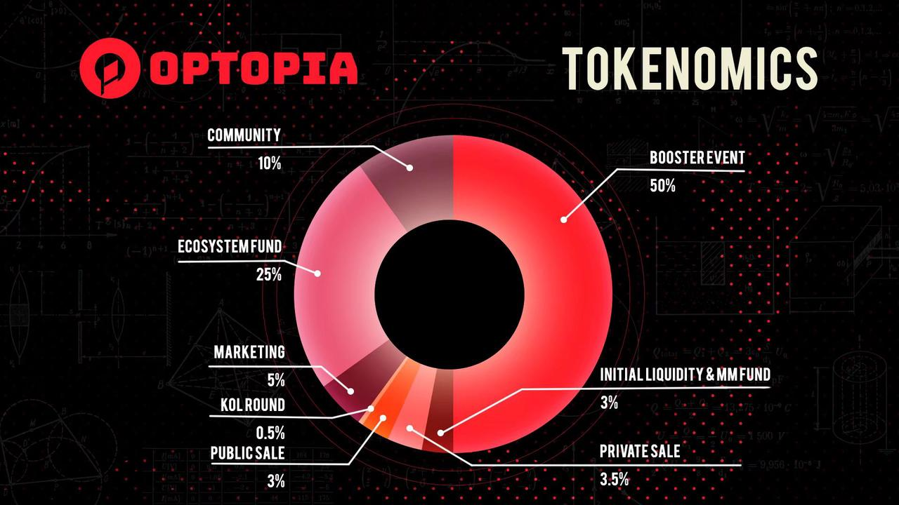
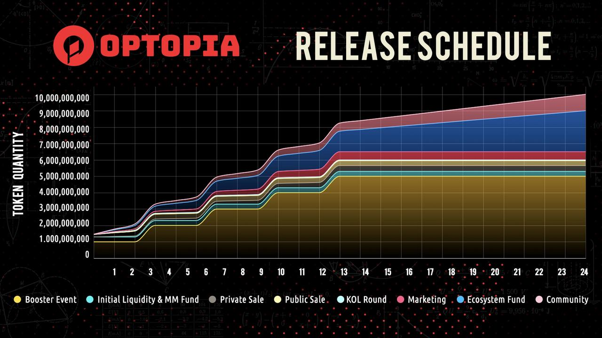

# OPAI Tokenomics

## OPAI Token Functions

The OPAI token framework plays a central role in the Optopia ecosystem, serving various critical functions that facilitate and govern AI applications. Here’s a summary of its main functionalities:

1. **Incentivization:** OPAI tokens are used as incentives for various participants within the ecosystem. Intent Publishers use them to encourage AI Agents to execute specific intents by attaching these tokens as rewards. Additionally, builders are rewarded with a share of points, which can be redeemed for OPAI tokens, based on the usage of their developed knowledge by AI Agents.
2. **Governance:** OPAI Holders who lock their tokens receive Vote Lock Tokens (vlOPAI), which grant them the power to participate in governance decisions. This includes voting on the emission weight of intents within the Intent Center, influencing the distribution and amount of OPAI rewards allocated to AI Agents upon successful completion of tasks.
3. **Reward Distribution:** AI Agents earn Reward Points upon successfully completing intents, which are convertible into rewards, presumably including OPAI tokens. This reward system is designed to facilitate the practical application of AI through effective task execution and learning enhancements.
4.  **Knowledge Enhancement:** The token framework supports the development and enhancement of AI capabilities by incentivizing Builders to create and refine knowledge that AI Agents can learn and use. This process not only improves the performance of AI Agents but also contributes to the overall advancement of AI technology within the ecosystem.

    \
    Overall, the OPAI token framework is essential for driving participation, facilitating governance, enhancing AI capabilities, and distributing rewards within the Optopia ecosystem.

## Distribution of OPAI Tokens

The distribution of OPAI tokens within the Optopia ecosystem is carefully designed to support the growth and sustainability of AI applications on the platform. By allocating tokens to various aspects such as foundation reserves, booster events, LP operations, market activities, early investors, and community airdrops, Optopia aims to create a vibrant and inclusive ecosystem that fosters innovation and collaboration in the field of artificial intelligence.\
Overview

* Total Supply: 10,000,000,000 tokens
* Token Contract: Not yet deployed

<figure><figcaption></figcaption></figure>

**Booster Event: 50% (5 Billion)**5 billion OPAI tokens will be allocated for the Booster Event. This event will be conducted in multiple phases to ensure a fair and transparent launch of Optopia.

* 10% of the tokens will be allocated to Booster Event Season 1 for the Optopia Voyage event, serving as the airdrop and reward budget (2%) and gas mining (8%). These tokens will be fully unlocked at the time of the TGE.
* The remaining 40% will be allocated over the following year in multiple phases to future airdrops, rewards, and additional Booster Events to further promote the development of the Optopia network.

\
**Ecosystem Fund: 25% (2.5 Billion)**2.5 billion OPAI tokens have been allocated to the foundation's ecosystem fund, set to unlock over a 24-month period. These tokens will be used to support ecosystem development and various activities, such as development operations, ecosystem incentives, and research and development. The specific allocation of these tokens will be determined by the community and the Optopia team through governance voting.\
**Community: 10% (1 Billion)**1 billion OPAI tokens will be reserved for the community, set to unlock over a 24-month period. These tokens will be used as future community incentives and contributor rewards, providing operational flexibility for the Optopia project.\
**Marketing: 5% (500 Million)**500 million OPAI tokens will be allocated for market operations, marketing activities, and the establishment of strategic partnerships, with a 12-month vesting period. These tokens will help promote the Optopia platform and facilitate collaboration with relevant stakeholders.\
**Token Sale: 7% (700 Million)**700 million OPAI tokens will be assigned to early investors in Optopia. This category includes participants from Launchpad/IDO, KOL funding rounds, and private funding rounds.

* **Private Sale:** 350 million OPAI tokens will be allocated to early private investors, with a 12-month vesting schedule.
* **Public Sale:** 300 million OPAI tokens will be allocated to IDO participants, 50% of the tokens will be unlocked at TGE, while the remaining tokens will be gradually released over the next two months.
* **KOL Round:** 50 million OPAI tokens will be allocated for the KOL funding round, 25% of the tokens will be unlocked at TGE, while the remaining tokens will be gradually released over the next three months.
* **Initial Liquidity & MM Fund: 3% (300 Million)**300 million OPAI tokens will be dedicated to LP (liquidity pool) operations. These tokens will provide initial liquidity and help mitigate volatility within the Optopia ecosystem.

<figure><figcaption></figcaption></figure>

