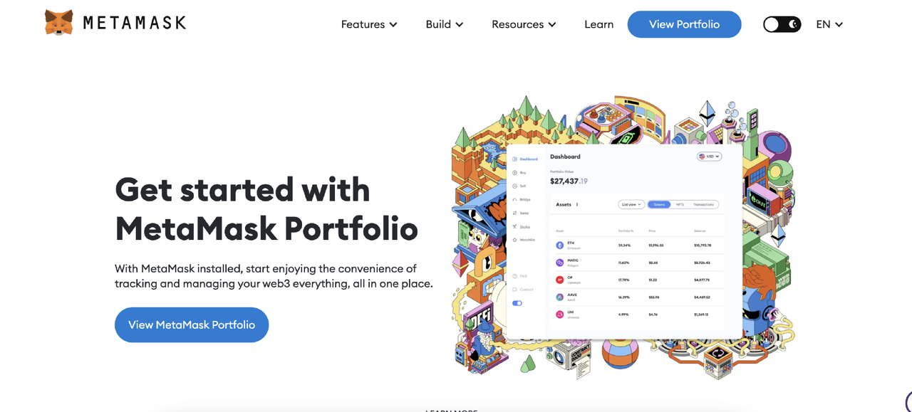
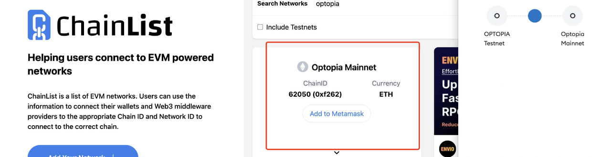
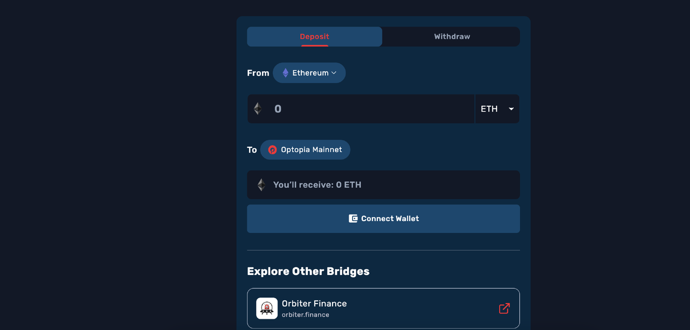
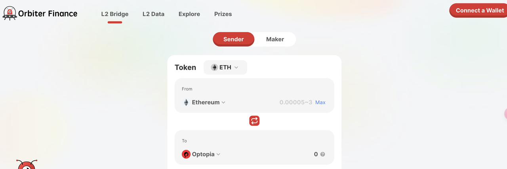
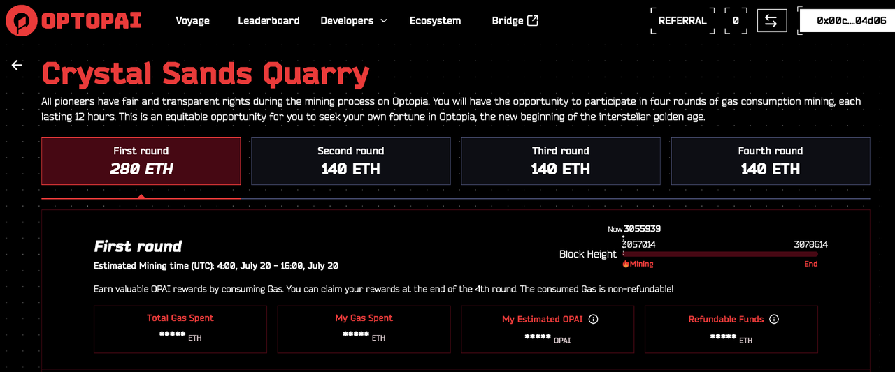
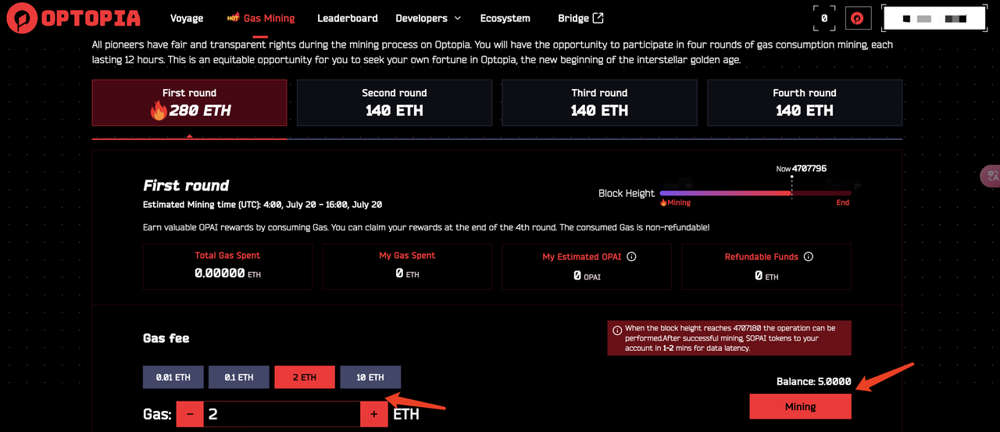
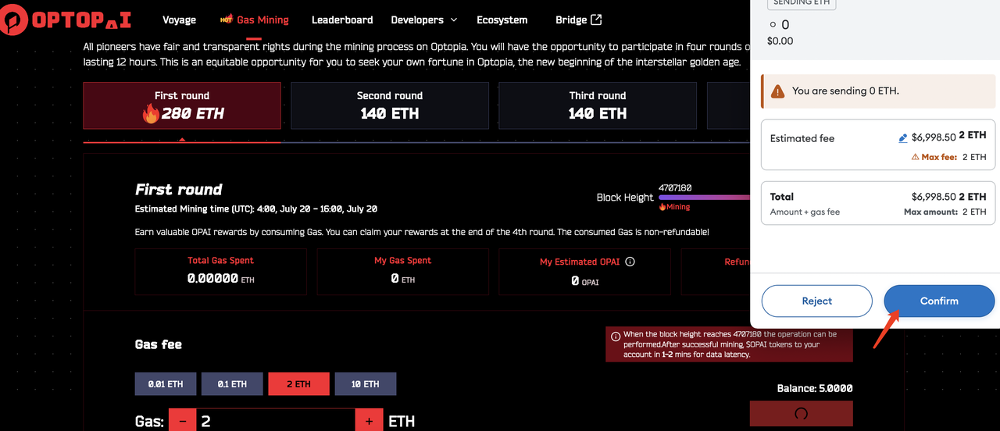

# Gas mining Tutorial

Welcome to Optopia, AI-driven, intent-centric Layer 2 network that allows permissionless intent creation.In this tutorial, we'll guide you through the steps to join Optopia Gas mining on the mainnet. Let's dive in and become part of the AI movement!

## Step1: **Prepare Your Wallets**

To get started, you'll need the following wallet:[https://metamask.io/](https://metamask.io/)

<figure><figcaption></figcaption></figure>

## Step2:**Add Optopia network to Your Wallet**

**Network Name：**Optopia MainnetRPC&#x20;

**Endpoint：**https://rpc-mainnet.optopia.ai,

[https://rpc-mainnet-2.optopia.ai](https://rpc-mainnet-2.optopia.ai)

**Chain ID：**62050Currency&#x20;

**Symbol**：ETH

**Block Explorer：**[https://scan.optopia.ai](https://scan.optopia.ai)

Or you can choose to add Optopia network to your wallet with one click on the chainlist:



<figure><figcaption></figcaption></figure>

## Step 3: **Deposit ETH to the Optopia mainnet via the cross-chain bridge or Orbiter Finance**

Currently, the official Rollup bridge and third-party bridges like Orbiter Finance are available.&#x20;

**Tutorial:** [https://docs.optopia.ai/tools/bridge](https://docs.optopia.ai/tools/bridge)

\
**Optopia Bridge：**[https://bridge.optopia.ai/](https://bridge.optopia.ai/)

<figure><figcaption></figcaption></figure>

**Orbiter Finance：**https://www.orbiter.finance/?source=Ethereum\&dest=Optopia\&token=ETH

<figure><figcaption></figcaption></figure>

## Step 4: **Access the Gas mining website and connect your wallet**[https://www.optopia.ai/mining](https://www.optopia.ai/mining)

##

<figure><figcaption></figcaption></figure>

<figure><figcaption></figcaption></figure>

## Step 5:**Set transaction fees**

Since there is a cap on the fee for each transaction, you need to manually set their transaction fees to the maximum if you want to maximize gas consumption,then click 'Mining' button,confirm it.

<figure><figcaption></figcaption></figure>

<figure><figcaption></figcaption></figure>

Congratulations! You have successfully minted! After successful mining, your $OPAI tokens will be credited to your account in 1-2 minutes due to data latency.

## Step6:**Gas fees will be refunded**

Token distribution will be based on the proportion of Gas fees contributed by users during each stage, ensuring a fair allocation. Any Gas fees exceeding the cap will be refunded proportionally to each user. No action is required, the exceeding gas fees will be automatically refunded in 24 hours after the event.

## Step7:**Claiming Airdrops**

After the Gas Mining event concludes, Optopia will initiate the process for claiming all airdrops. Rewards not claimed within the specified time will be burned. For more details, please refer to the upcoming airdrop announcement.
